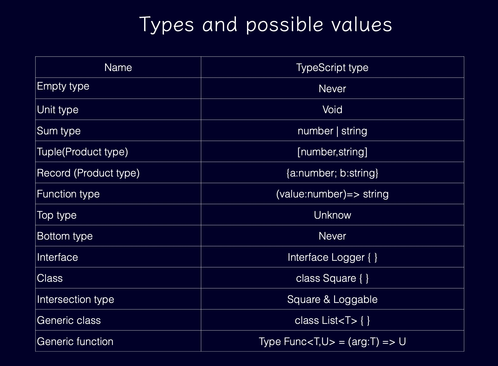

## 前情回顾

泛型

- 可以不用
- 泛型擦除
- 误当值用

## 类型总览

- 先来看一下 TypeScript 的类型总览
  

- 可能的值
  

## 基本类型

### 空类型

- 不返回值的函数

函数永远不会返回

```typescript
function raise(): never {
  throw new Error('ee');
}
function loop(): never {
  while (true) {}
}
```

- 自制空类型
  我们设计一个不能实例化的类就 ok 了

```typescript
class Empty {
  [EmptyType]: void;
  private constructor() {}
}
function raise1(): Empty {
  throw new Error('ee');
}
```

### 单元类型

- 返回值无意义
  函数会返回，但是不返回有意义的值，我们一般去执行一些副作用

```typescript
function log(value: unknown): void {
  console.log('value', value);
}
```

- 自制单元类型

我们制作一个能返回同一个值的的类的就 ok 了

```typescript
declare const UnitType: unique symbol;
class Unit {
  [UnitType]: void;
  static readonly value = new Unit();
  private constructor() {}
}

function log(value: unknown): Unit {
  console.log('value', value);
  return Unit.value;
}
```

### 数值类型

- number

```typescript
let a = 3;
```

- bigint

```typescript
let b = 3n;
```

### 布尔类型

- boolean

```typescript
let c = true;
```

### 文本类型

- string

```typescript
let d = 'hello';
```

### 数组类型

- array

```typescript
let a = [1, 2, 3];
let b: string[] = [];
b.push('a');
b.push('b');
```

### 引用类型

```typescript
const a = new Date();
```

## 字面量类型

- const 字面量
  **注意 let 和 const 的区别**

```typescript
// a: string
let a = 'hello';
// a: "hello"
const a = 'hello';

// b: number
let b = 100;
// b: 100
const b = 100;
```

- 模板字面量

```typescript
type ServiceURL = `/${string}`;

function get(url: ServiceURL) {
  return Promise.resolve({});
}

get('/student'); // ✅

get('student'); // ⛔️ Argument of type '"student"' is not assignable to parameter of type '`/${string}`'.ts(2345)

// "top-left" | "top-right" | "bottom-left" | "bottom-right"
type Type = `${'top' | 'bottom'}-${'left' | 'right'}`;
```

## 类型教父

- any
  我们可以把任意值赋值给 any,也能把 any 赋值给任意类型，为达目的不择手段，失去类型检查，兜底类型，要避免使用

```typescript
const a = 888 as any;
a.map(); // 编译通过
```

## 顶层类型

- 安全的反序列化

```typescript
class User {
  constructor(public name: string) {
    this.name = name;
  }
}
function parse(value: string): any {
  return JSON.parse(value);
}
function greet(user: User) {
  console.log(`hello ${user.name}`);
}
let user1 = parse('{"name": "tom"}');
greet(user1);

let user2 = parse('null');
greet(user2);
```

我们拿到一个序列化后的值，返回值为 any，可以赋值给任意类型，所以 greet(user1)和 greet(user2)都可以通过类型检查，但是 user2 是不正确的。
所以我们要有一种检查是否是 User 的方法

- 检查 User

```typescript
function isUser(user: any): user is User {
  if (user === null || user === undefined) {
    return false;
  }
  return typeof user.name === 'string';
}
```

`user is User` 是 TypeScript 特有的语法，当函数返回值为 true 的时候，编译器可以推断 user 为 User 类型

这样我们再去使用的时候

```typescript
if (isUser(user1)) {
  greet(user1);
}
if (isUser(user2)) {
  greet(user2);
}
```

这样我们就可以对 user 进行检查，确保了对错误的调用的处理

但是，这毕竟是我们人为的添加检查，有得时候我们可能会忘记去做检查，编辑器也会编译通过，那么有没有办法强制或者提醒我们去检查呢？

- unknown
  在上图中我们可以看到，unknown 位于整个类型的顶层，是其它任意类型的父类型，这就意味着，我们也可以把任意类型赋值给这个父类型
  > 顶层类型：如果我们可以把任意值赋值给一个类型，那么我们便说这个类型为顶层类型，其它类型都是该类型的子类型，该类型位于子类型结构的顶层
  > 我们再来修改代码

```typescript
function parse(value: string): unknown {
  return JSON.parse(value);
}
// ⛔️ Argument of type 'unknown' is not assignable to parameter of type 'User'.ts(2345)
greet(user1);
```

我们做了细微的修改，这样我们一旦从 JSON.parse()取得值，将 any 准化为 unknown，这个过程是安全的，因为我们可以把任意类型转化为 unknown, isUser 的参数我们保留了 any, 因为 unknown 是不能做 typeof user.name 检查的。

这样编译器就会提醒我们去做类型的检查，避免大意，只有确认了 unknown 为 User，我们才能把值用作 User。

- unknown 和 any 的区别
  > 我们都可以把任意值赋值给 unknown 和 any。在使用时，只有在确认了 unknown 具有某个类型时，我们才能把该值用作该类型，但是对于 any，我们可以把它传给任意类型的值，绕过了类型检查。

一般来说，我们处理一个可以是任何东西的值的时候，首先会把它视为一个顶层类型，然后用适当的检查，确保了它是我们想要的类型的时候，再把它向下转型为我们需要的类型。
