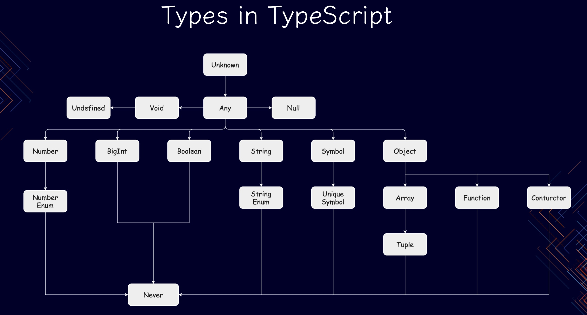

## 前情回顾

泛型

- 可以不用
- 泛型擦除
- 误当值用

## 类型总览

## 基本类型

- 空类型
- 单元类型
- 数值类型
- 布尔类型
- 文本类型
- 数组类型
- 引用类型

## 字面量类型

## 类型教父

## 顶层类型

## 底层类型

## 复合类型

### 元组类型

### 多选类型

- 枚举类型
- 可选类型

## 代数数据类型

- 和类型
- 乘积类型
